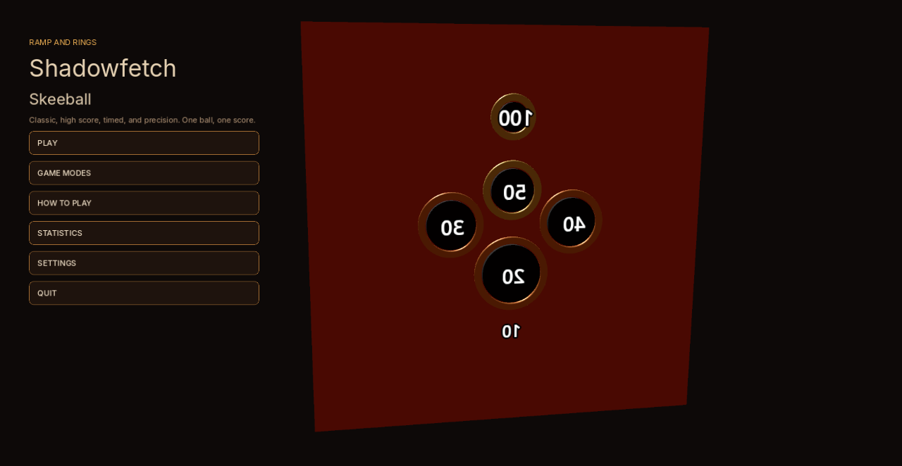
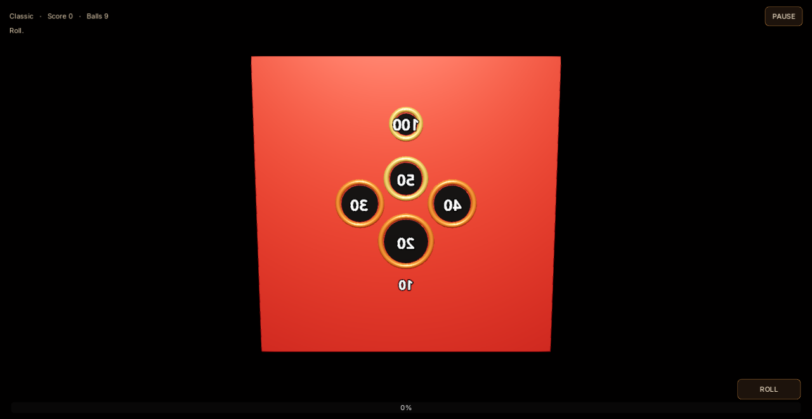

# Shadowfetch Skeeball

Classic, high score, timed, and precision for Linux. One ball, one score. Sibling table game — walnut and amber, not a clone.





## Download

Get `shadowfetch-skeeball-1.0.0-linux-x86_64.tar.gz` from the [latest release](https://github.com/Shadowfetchapps/shadowfetch-skeeball/releases/latest) (x86_64 Linux), then:

```bash
sha256sum -c shadowfetch-skeeball-1.0.0-linux-x86_64.tar.gz.sha256
tar -xzf shadowfetch-skeeball-1.0.0-linux-x86_64.tar.gz
cd shadowfetch-skeeball-1.0.0-linux-x86_64
./tools/install_linux.sh
```

## Run

```bash
shadowfetch-skeeball
```

## Tests

```bash
./tools/run_tests.sh
```

Hole centers, borders, 12,000 randomized landings, one-score-per-ball, and settings recovery.

## Export and install

```bash
./tools/export_linux.sh
./tools/install_linux.sh
```

If `rsvg-convert` is missing: `sudo apt install librsvg2-bin desktop-file-utils`

## Controls

- Mouse aims left/right
- Hold to charge, release to roll
- Esc pauses

## Assets

Inter fonts — SIL OFL 1.1. Lane, rings, icon, and audio are original.

No telemetry.
